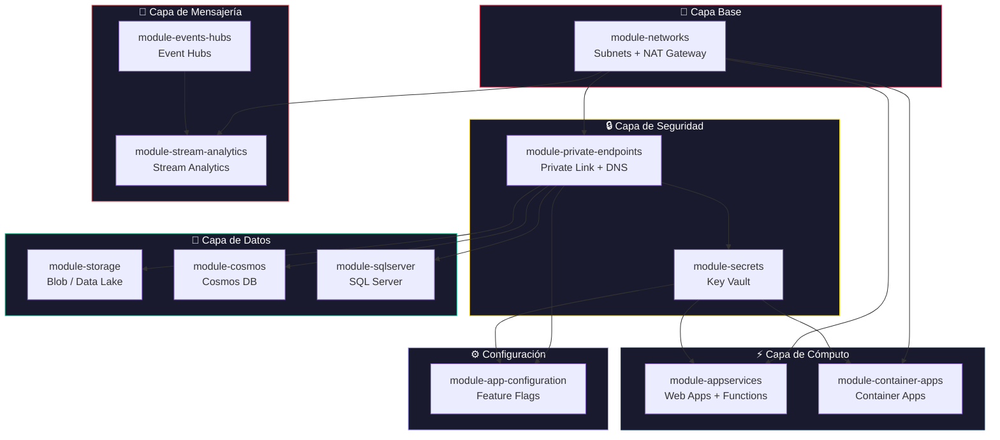
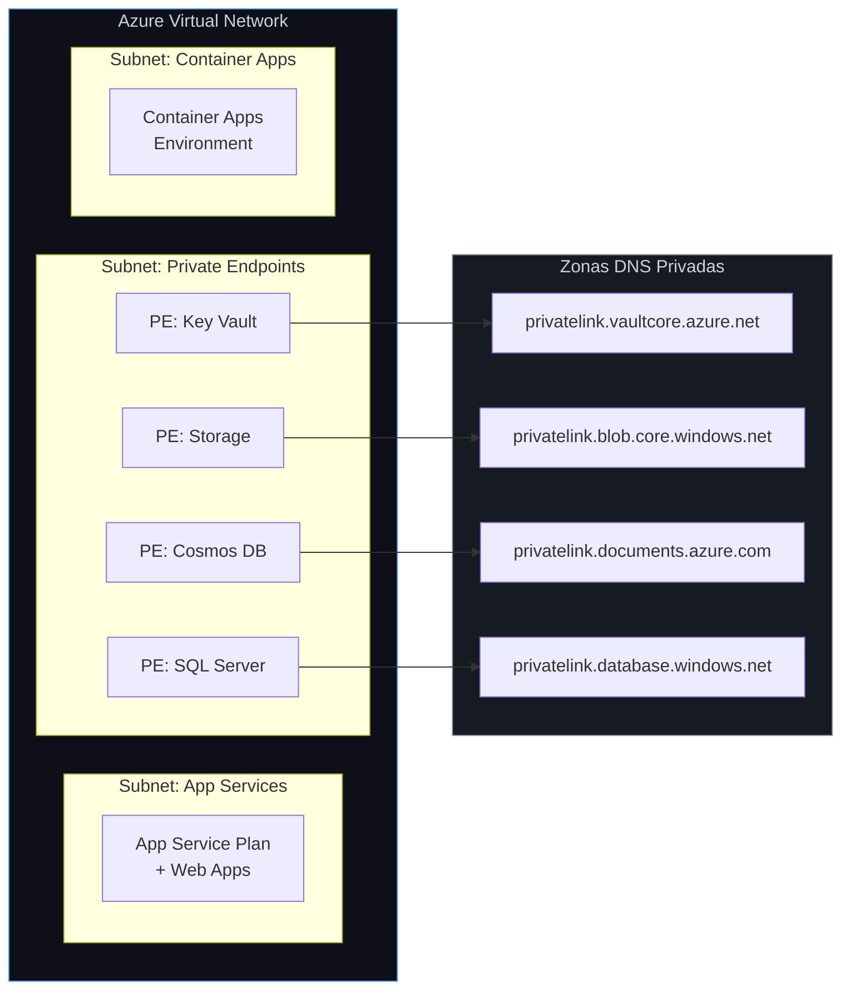
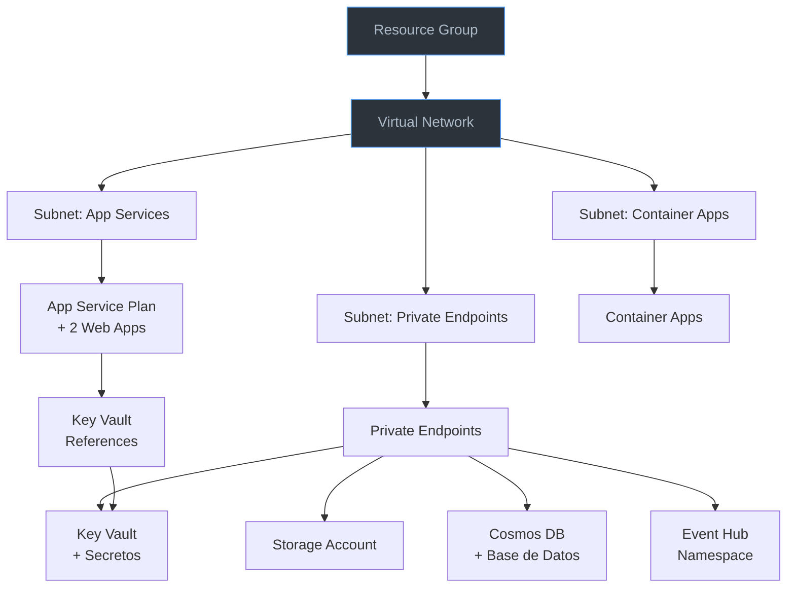

<div align="center">

# ☁️ Azure Terraform Custom Modules

**Módulos de Terraform reutilizables y listos para producción para infraestructura en Azure**

[](https://www.terraform.io/)
[](https://registry.terraform.io/providers/hashicorp/azurerm/latest)
[](./LICENSE)

Una colección seleccionada de módulos de Terraform diseñados para provisionar y gestionar infraestructura en la nube de Azure utilizando las mejores prácticas: redes privadas, diagnósticos, autoescalado y gestión de secretos integrados.

[Módulos](#-módulos) · [Inicio Rápido](#-inicio-rápido) · [Arquitectura](#-arquitectura) · [Ejemplo Completo](#-ejemplo-completo) · [Contribución](#-contribución)

</div>

---

## 📦 Módulos

| Módulo | Descripción | Características Principales |
|--------|-------------|-----------------------------|
| [`module-networks-infrastructure`](./module-networks-infrastructure/) | Subnets con NAT Gateway | Service endpoints, delegaciones, NAT gateway |
| [`module-private-endpoints-infrastructure`](./module-private-endpoints-infrastructure/) | Private Endpoints + DNS | Enlace automático a zonas DNS, integración con subnets |
| [`module-storage-infrastructure`](./module-storage-infrastructure/) | Cuentas de Almacenamiento | Blob/Data Lake, reglas de red, contenedores |
| [`module-secrets-infrastructure`](./module-secrets-infrastructure/) | Key Vault + Secretos | Private endpoints, políticas de acceso, diagnósticos |
| [`module-appservices-infrastructure`](./module-appservices-infrastructure/) | App Service + Functions | Autoescalado, deployment slots, referencias a Key Vault |
| [`module-container-apps-infrastructure`](./module-container-apps-infrastructure/) | Container Apps | Container registry, secretos de Key Vault, identidad administrada |
| [`module-cosmos-infrastructure`](./module-cosmos-infrastructure/) | Cosmos DB (SQL API) | Geo-replicación, diagnósticos, private endpoints |
| [`module-cosmos-postgres-sql-infrastructure`](./module-cosmos-postgres-sql-infrastructure/) | Cosmos DB para PostgreSQL | Clúster Citus, configuración de coordinador/nodos, HA |
| [`module-sqlserver-infrastructure`](./module-sqlserver-infrastructure/) | SQL Server | Contraseñas aleatorias, manejo de usuarios, reglas de firewall |
| [`module-events-hubs-infrastructure`](./module-events-hubs-infrastructure/) | Event Hubs | Registro de esquemas, captura de eventos, grupos de consumidores |
| [`module-app-configuration-infrastructure`](./module-app-configuration-infrastructure/) | App Configuration | Feature flags, referencias a Key Vault, réplicas |
| [`module-stream-analytics-infrastructure`](./module-stream-analytics-infrastructure/) | Stream Analytics | I/O desde Event Hub, acceso privado, consultas de transformación |

---

## 🚀 Inicio Rápido

### Requisitos Previos

- [Terraform](https://developer.hashicorp.com/terraform/install) >= 1.0
- [Azure CLI](https://learn.microsoft.com/cli/azure/install-azure-cli) autenticado
- Una suscripción de Azure

### Uso Básico

```hcl
# 1. Hacer referencia a un módulo desde el repositorio local
module "storage" {
  source = "./module-storage-infrastructure"

  resource_group_name = "rg-miapp-dev"
  identifier          = "miapp"
  containers          = ["data", "logs"]
}
```

### Inicializar y Aplicar

```bash
# Autenticarse en Azure
az login

# Inicializar Terraform
terraform init

# Previsualizar los cambios
terraform plan

# Aplicar los cambios
terraform apply
```

---

## 🏗 Arquitectura

Los módulos están diseñados para funcionar juntos como bloques de construcción. A continuación, se muestra una arquitectura de referencia que ilustra cómo se interconectan para un despliegue típico en producción:

### Grafo de Dependencias de los Módulos



### Topología de Red



---

## 📋 Ejemplo Completo

El directorio [`examples/complete/`](./examples/complete/) contiene un ejemplo completo y listo para producción que provisiona un stack de aplicación utilizando la mayoría de los módulos de manera conjunta.

### ¿Qué provisiona el Ejemplo Completo?



---

## 📁 Estructura del Módulo

Cada módulo sigue una estructura de archivos consistente y estandarizada:

```
module-<nombre>-infrastructure/
├── main.tf                 # Definiciones principales de recursos
├── variables.tf            # Variables de entrada con descripciones y validaciones
├── outputs.tf              # Valores de salida para consumidores del módulo
├── versions.tf             # Restricciones de versión de Terraform y providers
├── data.tf                 # Fuentes de datos (grupos de recursos, VNets, etc.)
├── diagnostics.tf          # Configuración de diagnósticos de Azure Monitor (opcional)
├── private_endpoints.tf    # Configuración de endpoints privados (opcional)
├── README.md               # Documentación del módulo con diagramas Mermaid
├── .gitignore              # Ignorar archivos específicos de Terraform
└── examples/
    └── simple/
        ├── main.tf         # Ejemplo de uso simple
        ├── variables.tf    # Variables de ejemplo
        └── outputs.tf      # Salidas del ejemplo
```

---

## 🔐 Consideraciones de Seguridad

Estos módulos implementan las siguientes mejores prácticas de seguridad:

| Práctica | Implementación |
|----------|---------------|
| **Redes Privadas** | Todos los servicios de datos soportan Private Endpoints a través de `module-private-endpoints-infrastructure` |
| **Gestión de Secretos** | Los secretos se almacenan en Key Vault; App Services los referencian mediante Key Vault URIs |
| **Aislamiento de Red** | Lista blanca de IPs y reglas de red a nivel de subred en todos los servicios |
| **Identidades Administradas** | Identidades asignadas por el usuario para autenticación entre servicios |
| **Diagnósticos** | Integración con Log Analytics para monitorización y auditoría |
| **Generación de Contraseñas** | Las credenciales SQL usan `random_password` — nunca incrustadas en el código |

---

## 🏷️ Convenciones de Nomenclatura

Los recursos siguen las convenciones de nomenclatura de Azure:

| Tipo de Recurso | Patrón | Ejemplo |
|-----------------|--------|---------|
| Resource Group | `rg-{proyecto}-{env}` | `rg-miapp-dev` |
| Virtual Network | `vnet-{proyecto}-{env}-{region}-{index}` | `vnet-data-dev-eastus-001` |
| Subnet | `snet-{proposito}-{env}` | `snet-appservice-dev` |
| Storage Account | `st{proyecto}{proposito}{env}` | `stmiappdatadev` |
| Key Vault | `kv-{proyecto}-{env}` | `kv-miapp-dev` |
| App Service Plan | `asp-{proyecto}-{env}` | `asp-miapp-dev` |

> **Nota**: La variable `identifier` en cada módulo se usa para generar estos nombres automáticamente.

---

## 🤝 Contribución

¡Las contribuciones son bienvenidas! Consulta el archivo [CONTRIBUTING.md](./CONTRIBUTING.md) para más detalles.

---

<div align="center">

Hecho con ❤️ para la comunidad de Azure + Terraform

</div>
