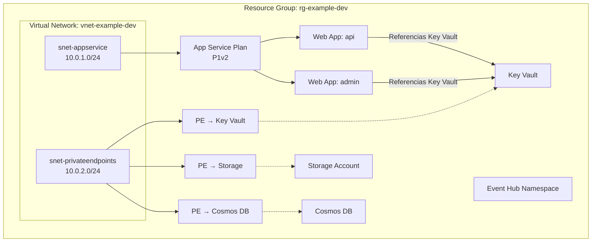

# Ejemplo Completo: Stack de Infraestructura Azure Multi-Módulo

Este ejemplo demuestra cómo utilizar múltiples módulos en conjunto para provisionar un stack de aplicación listo para producción en Azure.

## Qué Crea este Ejemplo

| Recurso | Módulo Utilizado | Propósito |
|---------|------------------|-----------|
| Subnet (App Services) | `module-networks-infrastructure` | Subnet dedicada para la integración de App Service a la VNet |
| Subnet (Private Endpoints) | `module-networks-infrastructure` | Subnet aislada para conexiones de endpoints privados |
| Storage Account | `module-storage-infrastructure` | Almacenamiento de blobs con private endpoint |
| Key Vault | `module-secrets-infrastructure` | Gestión centralizada de secretos |
| Cosmos DB | `module-cosmos-infrastructure` | Base de datos NoSQL con private endpoint |
| Event Hub | `module-events-hubs-infrastructure` | Plataforma de streaming de eventos |
| App Service Plan + Web Apps | `module-appservices-infrastructure` | Aplicaciones web integradas con Key Vault |
| Private Endpoints | `module-private-endpoints-infrastructure` | Conectividad segura hacia servicios de datos |

## Diagrama de Arquitectura



## Requisitos Previos

1. Un Resource Group de Azure existente
2. Una Virtual Network de Azure existente
3. Un Log Analytics Workspace
4. Azure CLI autenticado: `az login`

## Uso

```bash
# Copia las variables de ejemplo
cp terraform.tfvars.example terraform.tfvars

# Edita el archivo con tus propios valores
vim terraform.tfvars

# Despliega
terraform init
terraform plan
terraform apply
```

## Limpieza

```bash
terraform destroy
```
