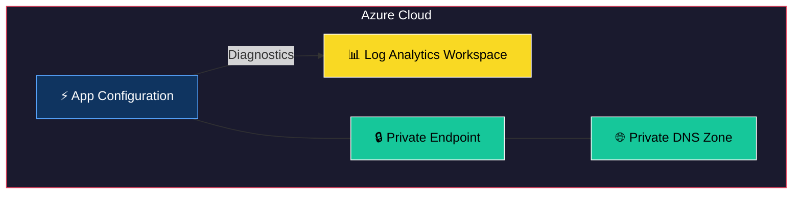
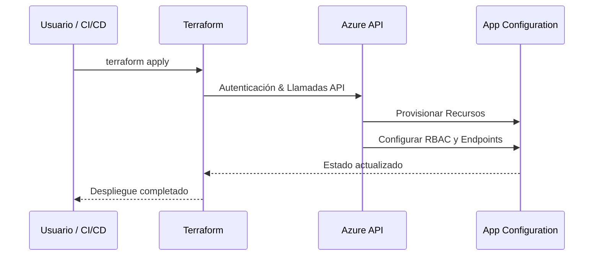

# Terraform Module: Azure App Configuration with Diagnostics and Secrets

Este módulo de Terraform permite configurar un **Azure App Configuration** con las siguientes funcionalidades:

- **Gestión de claves y valores**: Configuración automática de variables y secretos.
- **Diagnósticos avanzados**: Integración con Log Analytics para supervisión y auditoría.
- **Identidad administrada**: Uso de identidades administradas para acceso seguro a recursos.
- **Control dinámico**: Configuración basada en variables y expresiones dinámicas.
- **Seguridad mejorada**: Asignación de roles y permisos para control de acceso y creación de private endpoints para acceso seguro.

---


## 🏗 Arquitectura del Módulo



## 🔄 Flujo de Uso



## Requisitos

- **Terraform**: `>= 1.2.0`
- **Provider `azurerm`**: `~> 3.116`

---

## Recursos Proporcionados

Este módulo configura los siguientes recursos:

1. **Azure App Configuration**:
   - Configuración del App Configuration con soporte para claves y secretos.
   - Integración con identidades administradas para seguridad mejorada.
   - Configuración de réplicas en ambientes de producción.

2. **Azure Monitor Diagnostic Settings**:
   - Diagnósticos habilitados para auditoría y métricas.
   - Integración con Log Analytics Workspace.

3. **Role Assignments**:
   - Asignación de roles para acceso controlado al App Configuration.

4. **Secrets**:
   - Configuración de secretos en el App Configuration.
   
5. **Variables**:
   - Configuración de variables clave-valor en el App Configuration.
   
6. **Private Endpoints**:
   - Creación de endpoints privados para acceso seguro al App Configuration.


---

## Variables de Entrada

El módulo incluye las siguientes variables para su configuración:

| Variable                  | Tipo        | Descripción                                                                                     | Requerido |
|---------------------------|-------------|-------------------------------------------------------------------------------------------------|-----------|
| `resource_group_name`     | String      | Nombre del grupo de recursos donde se desplegarán los private endpoints.                        | Sí        |
| `identifier`              | String      | Identificador único para los recursos relacionados con los private endpoints.                   | Sí        |
| `sku`                     | String      | Nivel SKU para los recursos creados (valores: `standard`, `free`).                              | No        |
| `log_analytics_workspace_id` | String      | ID del Log Analytics Workspace para diagnósticos.                                              | No        |
| `managed_identity_id`     | String      | ID de la Identidad Administrada (MI) utilizada para acceder al Key Vault.                       | Sí        |
| `keyvault_secrets`        | Map(String) | Mapa de secretos extraídos del Key Vault que serán utilizados por los private endpoints.        | Sí        |
| `private_endpoint_config` | List(Map)   | Configuración para los private endpoints, incluyendo `subnet_id` y `resource_group_name`.       | Sí        |
| `secrets`                 | Map(String) | Mapa de secretos adicionales para ser configurados.                                            | No        |
| `variables`               | Map(String) | Mapa de variables clave-valor para ser configuradas.                                           | No        |

---

## Uso del Módulo

### Ejemplo Simple

Configuración básica del App Configuration con claves y valores manuales:

```hcl
module "app_configuration" {
  source                 = "./ruta/al/modulo"
  identifier             = "mi-app-conf"
  resource_group_name    = "mi-grupo-de-recursos"
  variables              = {
    API_URL = "https://example.com"
  }
}
```

### Ejemplo Completo

Configuración avanzada con diagnósticos, identidades administradas y secretos:

```hcl
module "app_configuration" {
  source                     = "./ruta/al/modulo"
  identifier                 = "mi-app-conf-completo"
  resource_group_name        = "mi-grupo-de-recursos"
  sku                        = "standard"
  managed_identity_id        = "/subscriptions/.../resourceGroups/.../providers/Microsoft.ManagedIdentity/userAssignedIdentities/mi-identidad"
  log_analytics_workspace_id = "/subscriptions/.../resourceGroups/.../providers/Microsoft.OperationalInsights/workspaces/mi-log-analytics"
  keyvault_secrets           = {
    SECRET_KEY = "vault/key-name"
  }
  private_endpoint_config    = [
    {
      subnet_id                    = "/subscriptions/.../resourceGroups/.../providers/Microsoft.Network/virtualNetworks/mi-vnet/subnets/mi-subnet"
      existing_private_dns_zone_id = "/subscriptions/.../resourceGroups/.../providers/Microsoft.Network/privateDnsZones/mi-dns-zone"
    }
  ]
  secrets                    = {
    SECRET_KEY = "valor-secreto"
  }
  variables                  = {
    API_URL = "https://example.com"
    ENV     = "production"
  }
}
```

---
