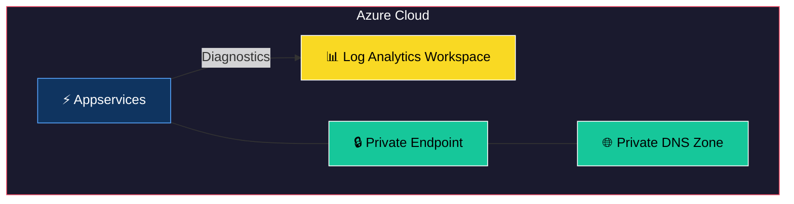
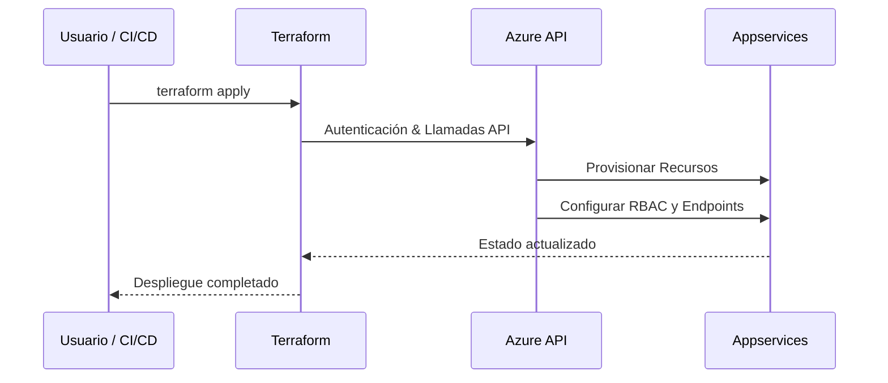

# Terraform Module: Azure App Service with Autoscaling and Diagnostics

Este módulo de Terraform permite configurar un **Azure App Service** con capacidades avanzadas, incluyendo:

- Creación de **App Service Plans** y **App Services** con soporte para backups y configuración avanzada.
- **Autoscaling** configurado dinámicamente basado en métricas como uso de CPU y memoria.
- Configuración de **Log Analytics** para diagnóstico.
- Soporte para entornos múltiples y ajustes personalizados según el entorno.

---


## 🏗 Arquitectura del Módulo



## 🔄 Flujo de Uso



## Requisitos

- **Terraform**: `>= 1.0.0`
- **Provider `azurerm`**: `~> 3.116`

---

## Recursos Proporcionados

El módulo configura los siguientes recursos:

1. **Azure App Service Plan**:
   - Creación de un Service Plan configurado para Linux con SKU definido dinámicamente.

2. **Azure App Service**:
   - Configuración de aplicaciones web con ajustes avanzados como TLS mínimo, rutas VNet habilitadas y solo FTPS.

3. **Azure App Service Slots**:
   - Configuración de slots de staging para entornos que lo requieren.

4. **Autoscaling**:
   - Configuración automática de escalado basado en métricas de CPU y memoria:
     - **CPU**: Escala hacia arriba si el uso supera el 75% durante 10 minutos.
     - **Memoria**: Escala hacia abajo si el uso cae por debajo del 60% durante 10 minutos.

5. **Log Analytics Diagnostic Settings**:
   - Configuración de diagnósticos para categorías como `AppServiceHTTPLogs`, `AppServiceConsoleLogs`, y más.

---

## Variables de Entrada

| Variable                        | Tipo            | Descripción                                                       | Requerido |
|---------------------------------|-----------------|-------------------------------------------------------------------|-----------|
| `resource_group_name`           | String          | Nombre del grupo de recursos donde se crearán los recursos.       | Sí        |
| `identifier`                    | String          | Identificador único para los recursos.                            | Sí        |
| `sku_tier`                      | String          | Nivel de SKU para el App Service Plan.                            | Sí        |
| `sku_name`                      | String          | Tamaño del SKU para el App Service Plan.                          | Sí        |
| `managed_identity_name`         | String          | Nombre de la identidad administrada a utilizar.                   | Sí        |
| `subnet_id`                     | String          | ID de la subred a usar para el App Service.                       | Sí        |
| `key_vault_secrets`             | Map(String)     | Mapa de secretos de Key Vault para aplicar al App Service.        | No        |
| `backup_storage_account_url`    | String          | URL de la cuenta de almacenamiento para backups.                  | No        |
| `app_service_web_apps`          | Map(Object)     | Configuración de aplicaciones web dentro del App Service.         | No        |
| `zone_balancing_enabled`        | Bool            | Habilitar balanceo de zona para el App Service.                   | No        |
| `log_analytics_workspace_id`    | String          | ID del workspace de Log Analytics para diagnósticos.              | No        |

---

## Uso del Módulo

### Uso Simple

```hcl
module "app_service" {
  source = "./ruta/al/modulo"

  resource_group_name = "mi-grupo-de-recursos"
  identifier          = "mi-recurso"
  sku_tier            = "PremiumV2"
  sku_name            = "P1v2"
  managed_identity_name = "mi-identidad-administrada"
  subnet_id           = "/subscriptions/.../subnets/subnet1"
}
```

### Uso Completo

```hcl
module "app_service" {
  source = "./ruta/al/modulo"

  resource_group_name = "mi-grupo-de-recursos"
  identifier          = "mi-recurso-completo"
  sku_tier            = "PremiumV3"
  sku_name            = "P3v3"
  managed_identity_name = "mi-identidad-administrada"
  subnet_id           = "/subscriptions/.../subnets/subnet1"
  key_vault_secrets = {
    "DB_PASSWORD" = "clave-secreta"
  }
  app_service_web_apps = {
    "mi-app" = {
      app_settings = {
        "ENV" = "production"
      },
      secrets_filter_regex = ".*PASSWORD.*"
    }
  }
  log_analytics_workspace_id = "/subscriptions/.../workspaces/mi-log-analytics"
}
```

---

## Cómo Usar Expresiones Regulares (Regex)

Las expresiones regulares son útiles para filtrar claves específicas, como en la variable `secrets_filter_regex`. Puedes definir patrones para incluir o excluir claves al aplicar configuraciones.

Ejemplo de uso de regex en este módulo:
```hcl
app_service_web_apps = {
  "mi-app" = {
    secrets_filter_regex = ".*PASSWORD.*"
  }
}
```
Esto aplica solo los secretos que contienen la palabra `PASSWORD`.

### Recursos Adicionales para Aprender Regex

- [Regex101](https://regex101.com/): Herramienta interactiva para probar expresiones regulares en diferentes lenguajes.
- [Guía de Regex de MDN](https://developer.mozilla.org/en-US/docs/Web/JavaScript/Guide/Regular_Expressions): Explicación detallada de los patrones y su uso.

---

## Consideraciones Adicionales

- Las configuraciones dinámicas en `autoscale` y `diagnostics` se ajustan automáticamente según el entorno (`environment`) definido en las etiquetas del grupo de recursos.
- Asegúrese de proporcionar las configuraciones necesarias para `app_service_web_apps` si se requieren ajustes específicos.

