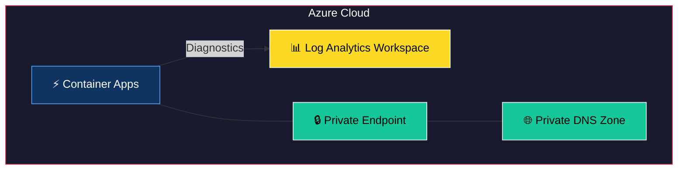
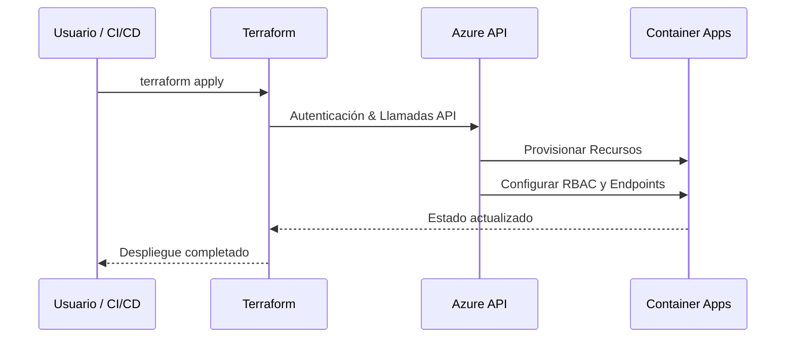

# Terraform Module: Azure Container Apps with Diagnostics and Key Vault Integration

Este módulo de Terraform permite configurar **Azure Container Apps** con las siguientes funcionalidades avanzadas:
- **Gestión de secretos**: Integración con Key Vault para la configuración de secretos sensibles.
- **Container Registry**: Configuración automática de registro para imágenes de contenedores.
- **Monitorización**: Configuración de Application Insights y Log Analytics para supervisión y diagnóstico.
- **Despliegue escalable**: Configuración de escalado automático con parámetros personalizados.
- **Acceso restringido**: Control de acceso mediante subredes y recursos de red definidos.

---


## 🏗 Arquitectura del Módulo



## 🔄 Flujo de Uso



## Requisitos

- **Terraform**: `>= 1.0.0`
- **Provider `azurerm`**: `~> 3.116`

---

## Recursos Proporcionados

Este módulo configura los siguientes recursos:

1. **Azure Container Apps**:
   - Despliegue de aplicaciones en contenedores con configuración de CPU, memoria y escalado automático.
   - Configuración de variables de entorno y secretos desde Key Vault.

2. **Container App Environment**:
   - Entorno compartido para aplicaciones en contenedores con soporte para redundancia de zona.

3. **Application Insights**:
   - Monitorización avanzada para las aplicaciones desplegadas.

4. **Log Analytics Diagnostic Settings**:
   - Diagnósticos habilitados para auditoría y métricas.

---

## Variables de Entrada

El módulo incluye las siguientes variables para su configuración:

| Variable                       | Tipo               | Descripción                                                                                     | Requerido |
|--------------------------------|--------------------|-------------------------------------------------------------------------------------------------|-----------|
| `resource_group_name`          | String             | Nombre del grupo de recursos donde se desplegarán las aplicaciones.                            | Sí        |
| `subnet_id`                    | String             | ID de la subred para los recursos de red.                                                      | Sí        |
| `identifier`                   | String             | Identificador único para los recursos creados.                                                 | Sí        |
| `log_analytics_workspace_id`   | String             | ID del Log Analytics Workspace para diagnósticos.                                              | Sí        |
| `managed_identity_name`        | String             | Nombre de la identidad administrada usada para los contenedores.                               | Sí        |
| `zone_redundancy_enabled`      | Bool               | Indica si se habilita redundancia de zona (activado automáticamente en entornos de producción).| No        |
| `key_vault_secrets`            | Map(String)        | Mapa de secretos a integrar desde Key Vault.                                                   | No        |
| `container_registry_login_server` | String          | URL del servidor del registro de contenedores.                                                 | Sí        |
| `container_apps`               | Map(Object)        | Configuración de las aplicaciones en contenedores, incluyendo CPU, memoria y variables.        | Sí        |

---

## Uso del Módulo

### Ejemplo Simple

Configuración básica de una aplicación en contenedor:

```hcl
module "container_apps" {
  source                    = "./ruta/al/modulo"
  identifier                = "mi-app"
  resource_group_name       = "mi-grupo-de-recursos"
  subnet_id                 = "/subscriptions/.../subnets/default"
  log_analytics_workspace_id = "/subscriptions/.../resourceGroups/.../providers/Microsoft.OperationalInsights/workspaces/mi-log-analytics"
  managed_identity_name     = "mi-managed-identity"
  container_registry_login_server = "myregistry.azurecr.io"
  container_apps = {
    app1 = {
      cpu          = 0.5
      memory       = "1Gi"
      port         = 8080
      environment_variables = {
        APP_ENV = "production"
      }
      secrets_filter_regex = ".*"
    }
  }
}
```

### Ejemplo Completo

Configuración avanzada con varios contenedores y escalado automático:

```hcl
module "container_apps" {
  source                    = "./ruta/al/modulo"
  identifier                = "mi-app-completa"
  resource_group_name       = "mi-grupo-de-recursos"
  subnet_id                 = "/subscriptions/.../subnets/default"
  log_analytics_workspace_id = "/subscriptions/.../resourceGroups/.../providers/Microsoft.OperationalInsights/workspaces/mi-log-analytics"
  managed_identity_name     = "mi-managed-identity"
  container_registry_login_server = "myregistry.azurecr.io"
  container_apps = {
    app1 = {
      cpu          = 0.5
      memory       = "1Gi"
      port         = 8080
      environment_variables = {
        APP_ENV = "production"
      }
      min_replicas = 1
      max_replicas = 5
    }
    app2 = {
      cpu          = 1
      memory       = "2Gi"
      port         = 9090
      environment_variables = {
        APP_ENV = "staging"
      }
      min_replicas = 1
      max_replicas = 3
    }
  }
}
```

---

Este README refleja las configuraciones descritas en el módulo. Si necesitas realizar ajustes adicionales, no dudes en solicitarlo.
