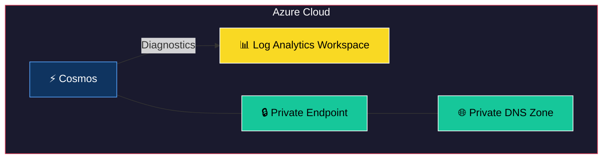
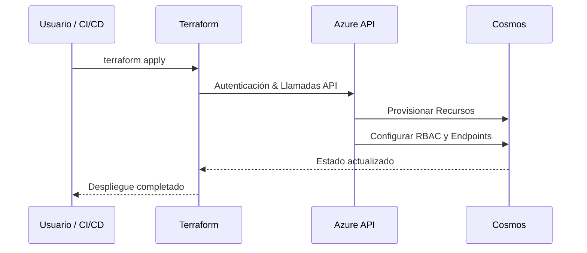

# Terraform Module: Azure CosmosDB with Diagnostics and Private Endpoints

Este módulo de Terraform permite configurar una cuenta de **Azure CosmosDB** con soporte para diagnóstico, bases de datos SQL y contenedores, además de la integración con endpoints privados. Está diseñado para garantizar seguridad y resiliencia, integrándose con otras infraestructuras en Azure.

---


## 🏗 Arquitectura del Módulo



## 🔄 Flujo de Uso



## Requisitos

- **Terraform**: `>= 1.0.0`
- **Providers**:
  - `azurerm`: `~> 3.116`
  - `http`: `~> 3.0`

---

## Recursos Proporcionados

Este módulo configura los siguientes recursos:

1. **Azure CosmosDB Account**:
   - Configura una cuenta de CosmosDB con soporte para múltiples ubicaciones y redundancia.
2. **Azure CosmosDB SQL Databases**:
   - Crea bases de datos SQL en la cuenta de CosmosDB.
3. **Azure CosmosDB SQL Containers**:
   - Configura contenedores dentro de las bases de datos SQL con políticas de partición e indexación.
4. **Azure Monitor Diagnostic Setting**:
   - Habilita el envío de logs y métricas a un Log Analytics Workspace.
5. **Private Endpoints**:
   - Integra la cuenta de CosmosDB con endpoints privados para acceso seguro.

---

## Variables de Entrada

Las siguientes variables son utilizadas para configurar este módulo:

| Variable                   | Tipo          | Descripción                                                                                     | Requerido |
|----------------------------|---------------|-------------------------------------------------------------------------------------------------|-----------|
| `resource_group_name`      | String        | Nombre del grupo de recursos donde se creará el recurso.                                        | Sí        |
| `identifier`               | String        | Identificador único para el recurso.                                                           | Sí        |
| `ip_range_whitelist`       | List(String)  | Lista de direcciones IP permitidas para acceder al recurso.                                     | No        |
| `subnets_id_whitelist`     | List(String)  | Lista de IDs de subredes permitidas para acceder al recurso.                                    | No        |
| `log_analytics_workspace_id` | String      | ID del Log Analytics Workspace donde se enviarán los diagnósticos.                              | No        |
| `sql_databases`            | Map(Object)   | Configuración de las bases de datos SQL a crear en CosmosDB.                                    | No        |
| `private_endpoints`        | List(Map)     | Configuración de los endpoints privados a integrar.                                             | No        |

---

## Validaciones de Variables

El módulo incluye validaciones para garantizar configuraciones correctas:

1. **`resource_group_name`**:
   - Debe contener solo caracteres alfanuméricos, guiones bajos (`_`) o guiones (`-`).
2. **`identifier`**:
   - Debe tener entre 3 y 18 caracteres.
3. **`ip_range_whitelist`**:
   - Cada dirección debe ser válida o estar en notación CIDR.
4. **`subnets_id_whitelist`**:
   - Cada ID de subred debe seguir el formato de Azure: `/subscriptions/{subscriptionId}/resourceGroups/{resourceGroupName}/providers/{resourceProviderNamespace}/{resourceType}/{resourceName}`.
5. **`log_analytics_workspace_id`**:
   - Si se proporciona, debe seguir el formato de Azure.
6. **`sql_databases`**:
   - Cada base de datos debe incluir al menos una ruta de partición.

---

## Uso del Módulo

### Ejemplo Básico

```hcl
module "cosmosdb" {
  source = "./ruta/al/modulo"

  resource_group_name = "mi-grupo-recursos"
  identifier          = "mi-cosmosdb-unico"
  ip_range_whitelist  = ["192.168.1.0/24"]
  sql_databases = {
    "mi-database" = {
      partition_key_paths = ["/id"]
      max_throughput      = 4000
    }
  }
}
```

### Uso Completo

```hcl
module "cosmosdb" {
  source = "./ruta/al/modulo"

  resource_group_name      = "mi-grupo-recursos"
  identifier               = "mi-cosmosdb-unico"
  ip_range_whitelist       = ["192.168.1.0/24", "10.0.0.0/16"]
  subnets_id_whitelist     = [
    "/subscriptions/<subscription_id>/resourceGroups/<resource_group>/providers/Microsoft.Network/virtualNetworks/<vnet>/subnets/<subnet>"
  ]
  log_analytics_workspace_id = "/subscriptions/<subscription_id>/resourceGroups/<resource_group>/providers/Microsoft.OperationalInsights/workspaces/<workspace_name>"
  sql_databases = {
    "mi-database" = {
      partition_key_paths = ["/id"]
      excluded_paths      = ["/tmp"]
      max_throughput      = 4000
    }
  }
  private_endpoints = [
    {
      subnet_id                 = "/subscriptions/<subscription_id>/resourceGroups/<resource_group>/providers/Microsoft.Network/virtualNetworks/<vnet>/subnets/<subnet>"
      existing_private_dns_zone_id = "/subscriptions/<subscription_id>/resourceGroups/<resource_group>/providers/Microsoft.Network/privateDnsZones/<dns_zone>"
    }
  ]
}
```

---

## Salidas

| Salida              | Descripción                                    |
|---------------------|------------------------------------------------|
| `cosmos_endpoint`   | El endpoint principal de la cuenta CosmosDB.   |
| `cosmos_primary_key`| La clave principal para acceso a CosmosDB.     |

---

## Mantenimiento y Versionado

Este módulo sigue las mejores prácticas de Terraform y utiliza bloqueos de versiones para garantizar la estabilidad del proveedor utilizado.

---

## Notas

Este módulo está optimizado para entornos empresariales con requisitos estrictos de seguridad y desempeño.
