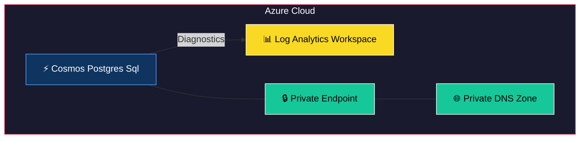
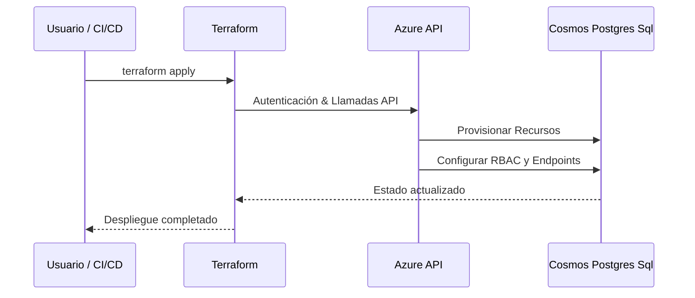
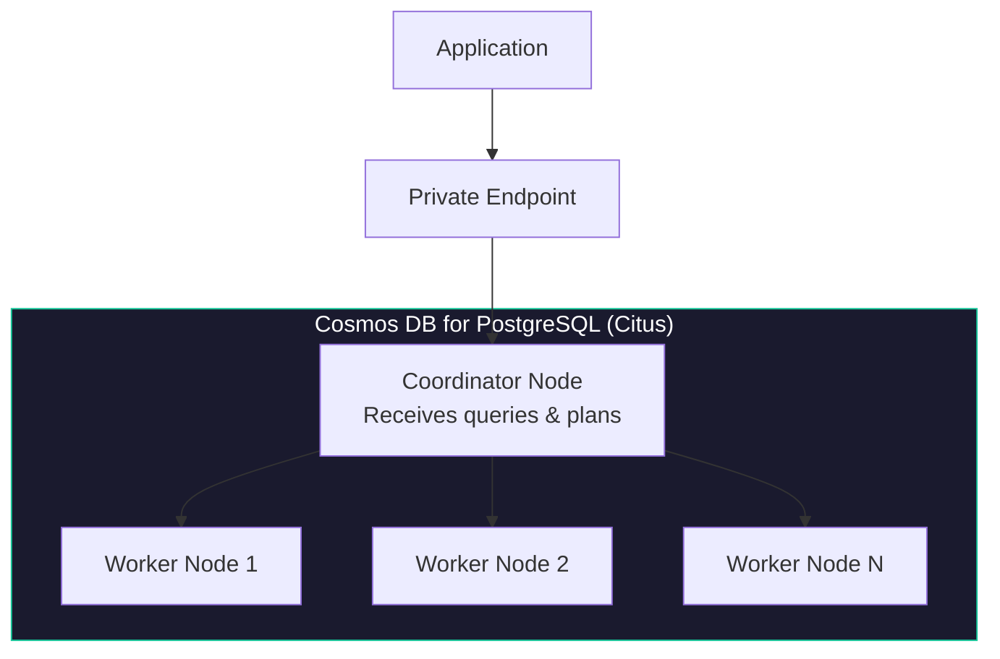

# Terraform Module: Azure Cosmos DB for PostgreSQL (Citus) with Diagnostics and Private Endpoints

This Terraform module provisions an **Azure Cosmos DB for PostgreSQL** cluster (powered by the Citus extension) with enterprise-grade features:

---

## Features

- **Citus Cluster**: Distributed PostgreSQL with coordinator + worker nodes
- **User Management**: Automatic creation of database roles with generated passwords
- **High Availability**: Configurable HA with coordinator and node redundancy
- **Coordinator/Node Sizing**: Fine-grained control over vCores, storage, and server edition
- **Maintenance Windows**: Configurable maintenance schedules
- **Private Endpoints**: Secure private connectivity via Azure Private Link
- **Diagnostics**: Integration with Azure Monitor and Log Analytics
- **IP Whitelisting**: Firewall rules with CIDR support

---


## 🏗 Arquitectura del Módulo



## 🔄 Flujo de Uso



## Requirements

| Name | Version |
|------|---------|
| Terraform | `>= 1.0.0` |
| azurerm | `~> 4.16` |
| http | `~> 3.0` |

---

## Usage

### Basic Example

```hcl
module "cosmos_postgresql" {
  source = "git::https://github.com/<your-org>/azure-terraform-custom-modules.git//module-cosmos-postgres-sql-infrastructure"

  resource_group_name        = "rg-myapp-dev"
  identifier                 = "myapp"
  log_analytics_workspace_id = "<log-analytics-workspace-id>"
  enable_public_access       = false

  ip_range_whitelist    = []
  users_names_list      = ["app_user", "readonly_user"]
  passwords_length      = 24

  coordinator_vcore_count         = 4
  coordinator_storage_quota_in_mb = 131072
  node_count                      = 2
  node_vcores                     = 4
  node_storage_quota_in_mb        = 131072

  private_endpoints = {
    "postgres" = {
      subnet_id             = "<private-endpoint-subnet-id>"
      private_dns_zone_name = "privatelink.postgres.cosmos.azure.com"
      subresource_name      = "coordinator"
    }
  }
}
```

### Full Configuration

```hcl
module "cosmos_postgresql" {
  source = "git::https://github.com/<your-org>/azure-terraform-custom-modules.git//module-cosmos-postgres-sql-infrastructure"

  resource_group_name        = "rg-myapp-prd"
  identifier                 = "myapp"
  log_analytics_workspace_id = "<log-analytics-workspace-id>"
  enable_public_access       = false

  citus_version      = "12.1"
  sql_version        = "16"
  ha_enabled         = true

  coordinator_vcore_count         = 8
  coordinator_storage_quota_in_mb = 262144
  node_count                      = 3
  node_server_edition             = "MemoryOptimized"
  node_vcores                     = 8
  node_storage_quota_in_mb        = 524288

  shards_on_coordinator_enabled = true
  preferred_primary_zone        = "1"

  users_names_list           = ["app_user", "etl_user", "readonly_user"]
  passwords_length           = 32
  passwords_special_characters = "!@#$%"

  maintenance_window = {
    day_of_week  = 0
    start_hour   = 3
    start_minute = 0
  }

  ip_range_whitelist = []

  private_endpoints = {
    "coordinator" = {
      subnet_id             = "<private-endpoint-subnet-id>"
      private_dns_zone_name = "privatelink.postgres.cosmos.azure.com"
      subresource_name      = "coordinator"
    }
  }
}
```

---

## Variables

| Variable | Type | Description | Required |
|----------|------|-------------|----------|
| `resource_group_name` | `string` | Name of the Azure Resource Group | Yes |
| `identifier` | `string` | Unique identifier for naming resources (3-18 chars) | Yes |
| `ip_range_whitelist` | `list(string)` | IP addresses/CIDRs allowed to access the cluster | No |
| `log_analytics_workspace_id` | `string` | Log Analytics Workspace ID for diagnostics | No |
| `private_endpoints` | `map(object)` | Private endpoint configurations | No |
| `coordinator_configuration` | `map(object)` | Coordinator server parameter overrides | No |
| `node_configuration` | `map(object)` | Node server parameter overrides | No |
| `users_names_list` | `list(string)` | Database roles to create | No |
| `passwords_length` | `number` | Length of generated passwords | No |
| `passwords_special_characters` | `string` | Allowed special characters in passwords | No |
| `citus_version` | `string` | Citus extension version | No |
| `sql_version` | `string` | PostgreSQL engine version | No |
| `coordinator_vcore_count` | `number` | vCores for the coordinator node | No |
| `coordinator_storage_quota_in_mb` | `number` | Storage quota for the coordinator (MB) | No |
| `node_count` | `number` | Number of worker nodes | No |
| `node_server_edition` | `string` | Server edition for worker nodes | No |
| `node_vcores` | `number` | vCores per worker node | No |
| `node_storage_quota_in_mb` | `number` | Storage quota per worker node (MB) | No |
| `shards_on_coordinator_enabled` | `bool` | Enable shard placement on the coordinator | No |
| `preferred_primary_zone` | `string` | Preferred availability zone | No |
| `maintenance_window` | `object` | Maintenance window configuration | No |
| `ha_enabled` | `bool` | Enable high availability | No |
| `enable_public_access` | `bool` | Enable public network access | No |

---

## Outputs

| Output | Description | Sensitive |
|--------|-------------|-----------|
| `servers_fqdn` | The FQDN of the coordinator server | Yes |
| `administrator_login_password` | The admin login password | Yes |
| `users_credentials` | Map of username → generated password | Yes |

---

## Architecture



---

## Notes

- Passwords are generated using `random_password` and exposed via the `users_credentials` output — store them securely after deployment.
- The module supports Citus-specific features like `shards_on_coordinator_enabled` for single-node development scenarios.
- For production, enable `ha_enabled = true` for automatic failover.
