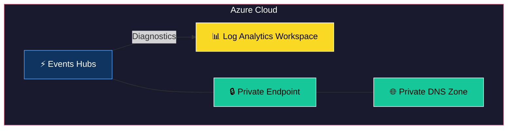
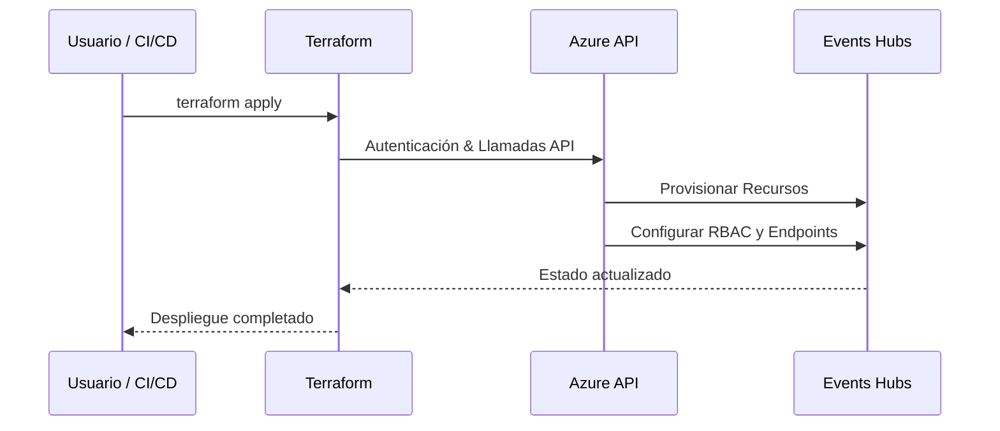

# Terraform Module: Azure Event Hubs

Este módulo de Terraform crea y configura un Event Hub en Azure con soporte para configuraciones personalizables.

---


## 🏗 Arquitectura del Módulo



## 🔄 Flujo de Uso



## Requisitos

- **Terraform**: `>= 1.0.0`
- **Proveedor de Azure**: `>= 3.0`

---

## Variables de Entrada

El módulo utiliza las siguientes variables de entrada:

- **identifier** *(requerido)*: El nombre del Event Hub existente o a ser creado. Debe tener entre 3 y 22 caracteres, excluyendo guiones (`-`).
- **resource_group_name** *(requerido)*: El nombre del grupo de recursos al que pertenece el Event Hub.
- **namespace_name** *(requerido)*: El nombre del Namespace al que pertenece el Event Hub.
- **partition_count** *(opcional)*: El número de particiones para el Event Hub. Valor por defecto: `2`.
- **message_retention_in_days** *(opcional)*: Los días de retención de mensajes. Valor por defecto: `7`.
- **capture_description** *(opcional)*: Configuración para la captura de datos en el Event Hub.

Para más detalles, consulte el archivo `variables.tf`.

---

## Outputs

El módulo proporciona los siguientes valores de salida:

- **eventhub_id**: El ID del Event Hub creado.
- **eventhub_arn**: El ARN del Event Hub.
- **eventhub_connection_string**: La cadena de conexión para acceder al Event Hub.

Para más detalles, consulte el archivo `outputs.tf`.

---

## Uso Simple

```hcl
module "event_hub" {
  source = "ruta/al/módulo"

  identifier           = "mi-eventhub"
  resource_group_name  = "mi-grupo-recursos"
  namespace_name       = "mi-namespace"
  partition_count      = 4
  message_retention_in_days = 10
}
```

## Uso Completo
    
```hcl
# example.tf
module "eventhub_module" {
  source = "../../"

  identifier                     = "your-eventhub-identifier"
  resource_group_name            = "your-resource-group-name"
  create_capture_storage_account = true
  subnets_id_whitelist           = [azurerm_subnet.subnet.id]
  schema_groups = {
    "schema-group-1" = {
      compatibility = "Backward"
      type          = "Avro"
    }
  }
  event_hubs = {
    "example-hub-1" = {
      partition_count   = 2
      message_retention = 7
      capture = {
        enabled             = true
        interval_in_seconds = 300
        size_limit_in_bytes = 10485760
      }
      authorization_rules = {
        listen = {
            listen = true
            send   = false
            manage = false
        }
        send = {
            listen = false
            send   = true
            manage = false
        }
      }
    }
  }
}
```

## Example Output Values

The module will produce output values similar to the following:

```json
{
  "connection_strings": {
    "example-hub-1": {
      "listen": "Endpoint=sb://eh-custom-eventhubs-test.servicebus.windows.net/;TOKEN;EntityPath=example-hub-1",
      "send": "Endpoint=sb://eh-custom-eventhubs-test.servicebus.windows.net/TOKEN;EntityPath=example-hub-1"
    },
    "example-hub-2": {
      "listen": "Endpoint=sb://eh-custom-eventhubs-test.servicebus.windows.net/TOKEN;EntityPath=example-hub-2",
      "send": "Endpoint=sb://eh-custom-eventhubs-test.servicebus.windows.net/;TOKEN;EntityPath=example-hub-2"
    }
  }
}
```
### Accessing Outputs

You can access the outputs from this module as follows:

```hcl
module "eventhubs" {
  source = "path/to/this/module"
  # Add necessary inputs here
}

# Example of accessing the connection string for 'example-hub-1' with 'listen' permission
output "example_connection_string" {
  value = module.eventhubs.connection_strings["example-hub-1"]["listen"]
}
```

---

## Recursos Creados

El módulo crea los siguientes recursos:

- Event Hub con configuraciones personalizables.
- Configuración opcional de captura de datos.

---

## Contribuciones

Si desea contribuir a este módulo, asegúrese de seguir las mejores prácticas y proporcionar documentación actualizada para los cambios realizados.

---

## Licencia

Este módulo está disponible bajo la licencia MIT. Consulte el archivo `LICENSE` para más detalles.
