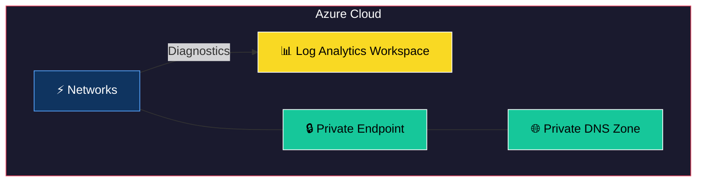
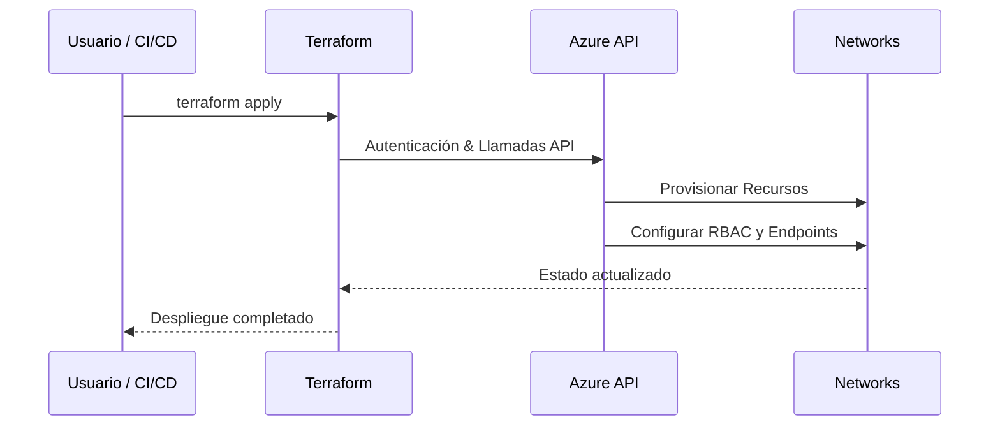

# Terraform Module: Azure Subnet with NAT Gateway and Service Delegations

Este módulo de Terraform crea una subred en una red virtual de Azure, con soporte opcional para NAT Gateway, puntos de servicio y delegaciones de servicio.

---


## 🏗 Arquitectura del Módulo



## 🔄 Flujo de Uso



## Requisitos

- **Terraform**: `>= 1.0.0`
- **Provider `azurerm`**: `~> 4.16`

---

## Recursos Proporcionados

El módulo configura los siguientes recursos:

1. **Azure Subnet**:
   - Crea una subred con configuraciones opcionales para puntos de servicio y delegaciones de servicio.

2. **Azure NAT Gateway** (opcional):
   - Asocia un NAT Gateway a la subred para administrar el tráfico saliente.

3. **Azure Public IP** (opcional):
   - Crea una dirección IP pública estática para el NAT Gateway.

4. **Associaciones de NAT Gateway** (opcional):
   - Vincula el NAT Gateway a la subred y a la dirección IP pública.

---

## Variables de Entrada

El módulo incluye las siguientes variables para su configuración:

| Variable                     | Tipo    | Descripción                                                                                     | Requerido |
|------------------------------|---------|-------------------------------------------------------------------------------------------------|-----------|
| `identifier`                 | String  | Identificador único para los recursos creados.                                                 | Sí        |
| `resource_group_name`        | String  | Nombre del grupo de recursos al que pertenece la red virtual.                                   | Sí        |
| `virtual_network_name`       | String  | Nombre de la red virtual donde se creará la subred.                                             | Sí        |
| `subnet_address_prefix`      | String  | Prefijo de direcciones de la subred.                                                            | Sí        |
| `enable_service_endpoints`   | Boolean | Habilitar puntos de servicio para la subred.                                                    | No        |
| `enable_app_service_delegation` | Boolean | Habilitar delegación para App Service en la subred.                                             | No        |
| `enable_containers_delegation` | Boolean | Habilitar delegación para Containers en la subred.                                              | No        |
| `enable_nat_gateway`         | Boolean | Habilitar NAT Gateway para la subred.                                                           | No        |

---

## Locales Utilizados

El módulo genera dinámicamente información clave a partir de las entradas proporcionadas mediante las siguientes variables locales:

- `environment`: Ambiente asociado al grupo de recursos.
- `location`: Ubicación del grupo de recursos.
- `tags`: Etiquetas del grupo de recursos.

---

## Uso del Módulo

### Uso Simple (Solo Valores Requeridos)

```hcl
module "subnet" {
  source                 = "./ruta/al/modulo"
  identifier             = "mi-subnet"
  resource_group_name    = "mi-grupo-de-recursos"
  virtual_network_name   = "mi-red-virtual"
  subnet_address_prefix  = "10.0.1.0/24"
}
```

### Uso Completo (Valores Requeridos y Opcionales)

```hcl
module "subnet" {
  source                     = "./ruta/al/modulo"
  identifier                 = "mi-subnet"
  resource_group_name        = "mi-grupo-de-recursos"
  virtual_network_name       = "mi-red-virtual"
  subnet_address_prefix      = "10.0.1.0/24"
  enable_service_endpoints   = true
  enable_app_service_delegation = true
  enable_containers_delegation = true
  enable_nat_gateway         = true
}
```
