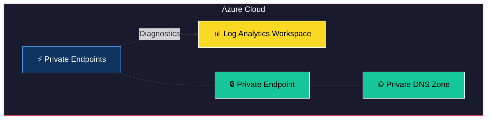
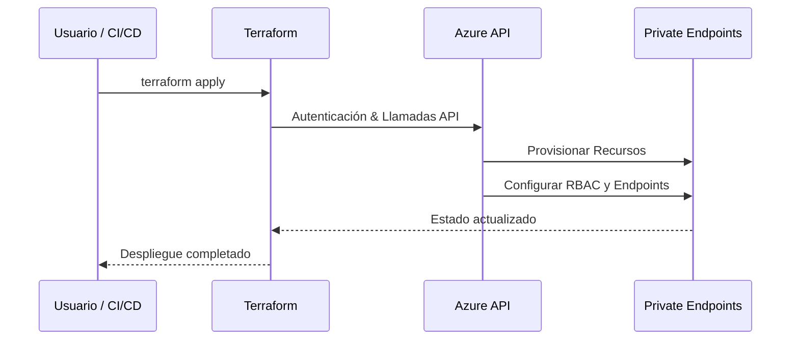

# Terraform Module: Azure Private Endpoint with DNS Configuration

Este módulo de Terraform permite crear un **Azure Private Endpoint** con soporte para configuraciones de DNS privadas y conexiones a recursos específicos en Azure. El módulo está diseñado para integrarse con redes virtuales y configurar automáticamente los enlaces necesarios para la zona DNS privada.

---


## 🏗 Arquitectura del Módulo



## 🔄 Flujo de Uso



## Requisitos

- **Terraform**: `>= 1.0.0`
- **Provider `azurerm`**: `~> 3.116`

---

## Recursos Proporcionados

El módulo configura los siguientes recursos:

1. **Private DNS Zone**:
   - Crea una zona DNS privada asociada al recurso, si no existe una zona proporcionada.

2. **Private DNS Zone Virtual Network Link**:
   - Vincula la zona DNS privada a la red virtual especificada.

3. **Azure Private Endpoint**:
   - Crea un endpoint privado que permite la conexión privada con un recurso.

---

## Variables de Entrada

El módulo incluye las siguientes variables para su configuración:

| Variable                              | Tipo   | Descripción                                                                                     | Requerido |
|---------------------------------------|--------|-------------------------------------------------------------------------------------------------|-----------|
| `subnet_id`                           | String | ID de la subred donde se creará el endpoint privado.                                            | Sí        |
| `resource_id`                         | String | ID del recurso al que se conectará el endpoint privado.                                         | Sí        |
| `identifier`                          | String | Identificador único para el recurso (utilizado en los nombres de los recursos).                | Sí        |
| `private_dns_zone_name`               | String | Nombre de la zona privada de DNS que se creará.                                                | Sí        |
| `subresource_name`                    | String | Nombre del subrecurso del recurso al que se conectará el endpoint privado.                     | Sí        |
| `existing_private_dns_zone_id`        | String | ID de una zona privada de DNS existente, si aplica.                                             | No        |

---

## Validaciones de Variables

El módulo incluye las siguientes validaciones para garantizar configuraciones correctas:

- **`subnet_id`**: Debe seguir el formato `/subscriptions/{subscriptionId}/resourceGroups/{resourceGroupName}/providers/{resourceProviderNamespace}/{resourceType}/{resourceName}`.
- **`resource_id`**: Debe seguir el formato `/subscriptions/{subscriptionId}/resourceGroups/{resourceGroupName}/providers/{resourceProviderNamespace}/{resourceType}/{resourceName}`.
- **`identifier`**: Debe tener entre 3 y 18 caracteres.
- **`private_dns_zone_name`**: Debe seguir el formato `privatelink.<service>.azure.<region>.cloudapp.<domain>` (por ejemplo, `privatelink.sql.azure.net`).
- **`existing_private_dns_zone_id`**: Si se proporciona, debe seguir el formato `/subscriptions/{subscriptionId}/resourceGroups/{resourceGroupName}/providers/{resourceProviderNamespace}/{resourceType}/{resourceName}`.

---

## Locales Utilizados

El módulo genera dinámicamente información clave a partir de los IDs proporcionados mediante las siguientes variables locales:

- `resource_resource_group_name`: Extrae el nombre del grupo de recursos del `resource_id`.
- `resource_subscription_id`: Extrae el ID de la suscripción del `resource_id`.
- `subnet_resource_group_name`: Extrae el nombre del grupo de recursos de la subred.
- `subnet_vnet_name`: Extrae el nombre de la red virtual asociada a la subred.
- `subnet_name`: Extrae el nombre de la subred.
- `private_dns_name`: Gestiona el nombre de la zona DNS privada (existente o creada).
- `private_dns_id`: Gestiona el ID de la zona DNS privada.

---

## Uso del Módulo

### Uso Simple (Solo Valores Requeridos)

```hcl
module "private_endpoint" {
  source = "./ruta/al/modulo"

  subnet_id             = "/subscriptions/<subscription_id>/resourceGroups/<resource_group>/providers/Microsoft.Network/virtualNetworks/<vnet>/subnets/<subnet>"
  resource_id           = "/subscriptions/<subscription_id>/resourceGroups/<resource_group>/providers/<resource_type>/<resource_name>"
  identifier            = "mi-recurso-unico"
  private_dns_zone_name = "privado.mi-dominio.local"
  subresource_name      = "mi-subrecurso"
}
```

### Uso Completo (Valores Requeridos y No Requeridos)

```hcl
module "private_endpoint" {
  source = "./ruta/al/modulo"

  subnet_id                           = "/subscriptions/<subscription_id>/resourceGroups/<resource_group>/providers/Microsoft.Network/virtualNetworks/<vnet>/subnets/<subnet>"
  resource_id                         = "/subscriptions/<subscription_id>/resourceGroups/<resource_group>/providers/<resource_type>/<resource_name>"
  identifier                          = "mi-recurso-unico"
  private_dns_zone_name               = "privado.mi-dominio.local"
  subresource_name                    = "mi-subrecurso"
  existing_private_dns_zone_id        = "/subscriptions/<subscription_id>/resourceGroups/<resource_group>/providers/Microsoft.Network/privateDnsZones/<dns_zone>"
}
```

---

## Validaciones de Variables y Ejecución

Para garantizar la validez de las configuraciones, el módulo realiza las siguientes validaciones sobre las variables:

1. **Regex**: Valida el formato de entradas como `subnet_id`, `resource_id`, y `existing_private_dns_zone_id`.
2. **Restricciones de longitud**: Valida que el identificador (`identifier`) esté entre 3 y 18 caracteres.
3. **Formatos de nombres**: Asegura que `private_dns_zone_name` siga los formatos recomendados por Azure.

Se recomienda probar los valores antes de aplicar los cambios al entorno de producción.

---

## Mantenimiento y Versionado

Este módulo sigue las mejores prácticas de Terraform y utiliza bloqueos de versiones para garantizar la estabilidad del provider utilizado.
