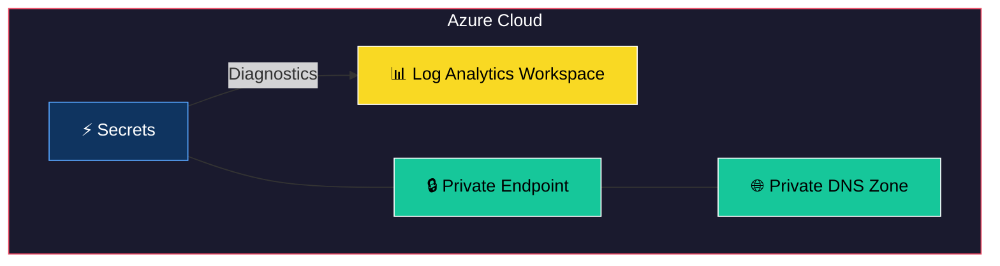
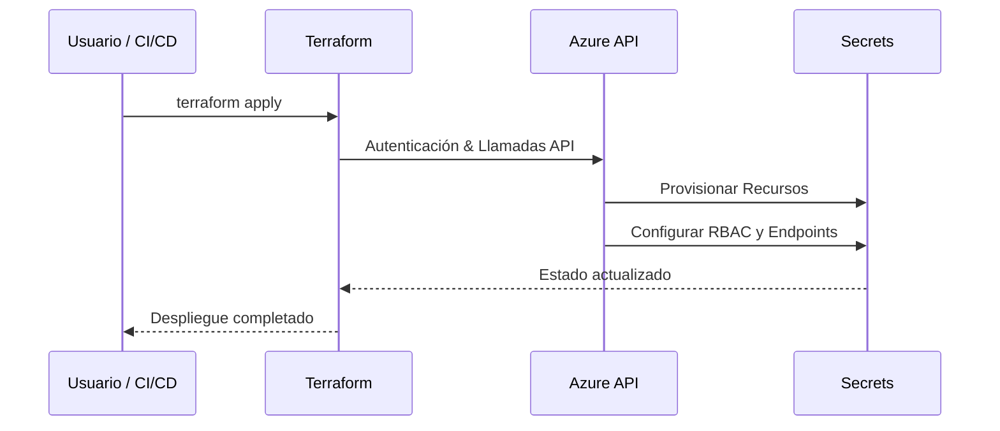

# Terraform Module: Azure Key Vault with Secrets and Private Endpoints

Este módulo de Terraform permite configurar un **Azure Key Vault** con las siguientes funcionalidades avanzadas:
- **Gestión de secretos**: Importación automática desde GitHub o variables proporcionadas.
- **Private Endpoints**: Configuración para acceso seguro mediante Azure Private Link.
- **Diagnósticos**: Integración con Log Analytics para supervisión y auditoría.
- **Acceso restringido**: Control de acceso basado en subredes, rangos IP y políticas específicas.
- **Políticas dinámicas**: Configuración automática de políticas de acceso basada en entradas definidas por el usuario.

---


## 🏗 Arquitectura del Módulo



## 🔄 Flujo de Uso



## Requisitos

- **Terraform**: `>= 1.2.0`
- **Provider `azurerm`**: `~> 3.116`
- **Provider `github`**: `~> 6.0`
- **Provider `http`**: `~> 3.0`

---

## Recursos Proporcionados

Este módulo configura los siguientes recursos:

1. **Azure Key Vault**:
   - Configuración del Key Vault con acceso restringido a subredes e IPs permitidas.
   - Políticas de acceso dinámicas para usuarios o aplicaciones.
   - Protección contra eliminación permanente (`purge_protection_enabled`) habilitada.

2. **Key Vault Secrets**:
   - Importación de secretos desde un repositorio de GitHub o definidos manualmente.
   - Aplicación de etiquetas para seguimiento de los secretos.

3. **Private Endpoints**:
   - Configuración de endpoints privados conectados al Key Vault.
   - Soporte para zonas DNS privadas existentes.

4. **Log Analytics Diagnostic Settings**:
   - Diagnósticos habilitados para auditoría y métricas.
   - Categorías específicas como `AuditEvent` y `AzurePolicyEvaluationDetails`.

5. **Configuraciones Adicionales**:
   - Recuperación automática de la IP pública para configurar acceso.
   - Uso de secretos filtrados por expresiones regulares.

---

## Variables de Entrada

El módulo incluye las siguientes variables para su configuración:

| Variable                                      | Tipo               | Descripción                                                                                     | Requerido |
|-----------------------------------------------|--------------------|-------------------------------------------------------------------------------------------------|-----------|
| `github_environment_secrets`                  | Map(String)        | Mapa de secretos sensibles a importar desde GitHub.                                             | No        |
| `environment_secrets`                         | Map(String)        | Mapa de secretos definidos manualmente.                                                        | No        |
| `github_repository`                           | String             | Nombre del repositorio GitHub que contiene los secretos.                                        | No        |
| `identifier`                                  | String             | Nombre único del Key Vault.                                                                     | Sí        |
| `resource_group_name`                         | String             | Nombre del grupo de recursos para el Key Vault.                                                | Sí        |
| `subnets_id_whitelist`                        | List(String)       | Lista de subredes con acceso al Key Vault.                                                     | No        |
| `ip_range_whitelist`                          | List(String)       | Lista de rangos IP permitidos para acceso al Key Vault.                                         | No        |
| `log_analytics_workspace_id`                  | String             | ID del Log Analytics Workspace para diagnósticos.                                              | No        |
| `access_policies`                             | List(Object)       | Lista de políticas de acceso con `principal_id` y acciones permitidas.                         | No        |
| `github_secrets_regex_filter`                 | String             | Filtro regex para excluir secretos específicos de GitHub.                                       | No        |
| `private_endpoints`                           | List(Map(String))  | Lista de configuraciones para private endpoints, incluyendo `subnet_id` y `existing_private_dns_zone_id`. | No        |

---

## Uso del Módulo

### Ejemplo Simple

Configuración básica de un Key Vault con secretos manuales:

```hcl
module "key_vault" {
  source                = "./ruta/al/modulo"
  identifier            = "mi-key-vault"
  resource_group_name   = "mi-grupo-de-recursos"
  environment_secrets   = {
    SECRET_API_KEY = "valor-secreto"
  }
}
```

### Ejemplo Completo

Configuración avanzada con Private Endpoints, integración de secretos desde GitHub y diagnósticos:

```hcl
module "key_vault" {
  source                                      = "./ruta/al/modulo"
  identifier                                  = "mi-key-vault-completo"
  resource_group_name                         = "mi-grupo-de-recursos"
  github_repository                           = "mi-repositorio"
  environment_secrets                         = {
    APP_SECRET_KEY = "clave123"
  }
  subnets_id_whitelist                        = ["/subscriptions/.../subnets/subnet1"]
  ip_range_whitelist                          = ["192.168.1.0/24"]
  log_analytics_workspace_id                  = "/subscriptions/.../resourceGroups/.../providers/Microsoft.OperationalInsights/workspaces/mi-log-analytics"
  access_policies                             = [
    {
      principal_id = "principal-id-1"
      actions      = ["get", "list"]
    },
    {
      principal_id = "principal-id-2"
      actions      = ["set", "delete"]
    }
  ]
  private_endpoints                          = [
    {
      subnet_id = "/subscriptions/.../subnets/subnet1"
      existing_private_dns_zone_id = "/subscriptions/.../privateDnsZones/zone1"
    }
  ]
}
```

---
