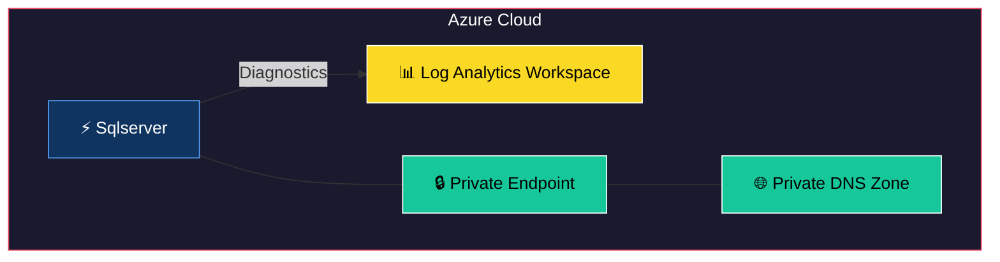
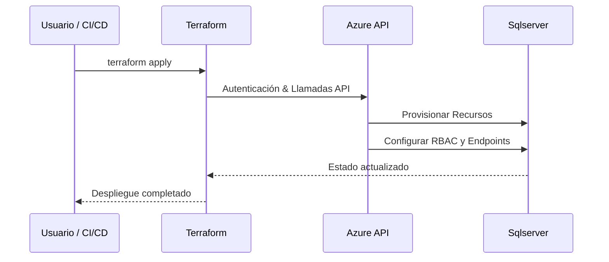
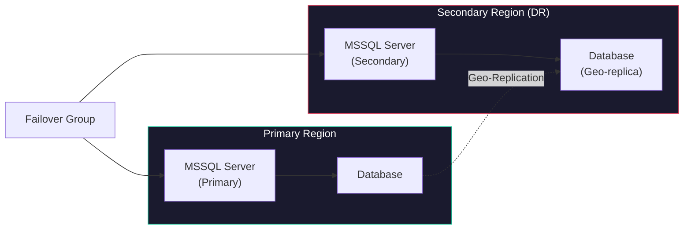

# Terraform Module: Azure MSSQL Server with Geo-Replication and Failover

This Terraform module provisions an **Azure MSSQL Server** infrastructure with enterprise-grade features:

---

## Features

- **Primary + Secondary Servers**: Geo-replicated SQL Server instances for disaster recovery
- **Failover Group**: Automatic failover configuration with read/write endpoint policies
- **Threat Detection**: Advanced threat protection with email alerts and audit logging
- **Backup Policies**: Long-term and short-term retention with configurable intervals
- **Firewall Rules**: IP-based whitelisting with CIDR support
- **Private Endpoints**: Secure private connectivity via Azure Private Link
- **Diagnostics**: Integration with Azure Monitor and Log Analytics
- **Security**: Random password generation for admin credentials, AAD integration, TLS 1.2 minimum

---


## 🏗 Arquitectura del Módulo



## 🔄 Flujo de Uso



## Requirements

| Name | Version |
|------|---------|
| Terraform | `>= 1.0.0` |
| azurerm | `~> 4.16` |
| http | `~> 3.0` |

---

## Usage

### Basic Example

```hcl
module "sqlserver" {
  source = "git::https://github.com/<your-org>/azure-terraform-custom-modules.git//module-sqlserver-infrastructure"

  resource_group_name        = "rg-myapp-dev"
  identifier                 = "myapp"
  log_analytics_workspace_id = "<log-analytics-workspace-id>"

  ip_range_whitelist = ["203.0.113.0/24"]

  private_endpoints = {
    "sqlserver" = {
      subnet_id             = "<private-endpoint-subnet-id>"
      private_dns_zone_name = "privatelink.database.windows.net"
      subresource_name      = "sqlServer"
    }
  }
}
```

---

## Variables

| Variable | Type | Description | Required |
|----------|------|-------------|----------|
| `resource_group_name` | `string` | Name of the Azure Resource Group | Yes |
| `identifier` | `string` | Unique identifier for naming resources | Yes |
| `ip_range_whitelist` | `list(string)` | List of IP addresses/CIDRs allowed to access the server | No |
| `log_analytics_workspace_id` | `string` | Log Analytics Workspace ID for diagnostics | No |
| `private_endpoints` | `map(object)` | Private endpoint configurations | No |
| `passwords_length` | `number` | Length of generated passwords | No |
| `passwords_special_characters` | `string` | Allowed special characters in generated passwords | No |

---

## Outputs

| Output | Description | Sensitive |
|--------|-------------|-----------|
| `servers_fqdn` | The FQDN of the primary SQL Server | Yes |
| `administrator_login_password` | The admin login password | Yes |
| `users_credentials` | Map of user credentials | Yes |

---

## Architecture



---

## Notes

- This module uses `lifecycle { prevent_destroy = true }` on servers and databases to prevent accidental deletion in production.
- Admin passwords are generated using `random_password` — never hardcoded.
- The failover group is configured in `Manual` mode by default for controlled failover scenarios.
