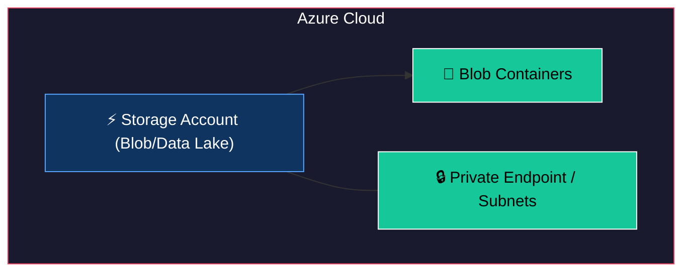
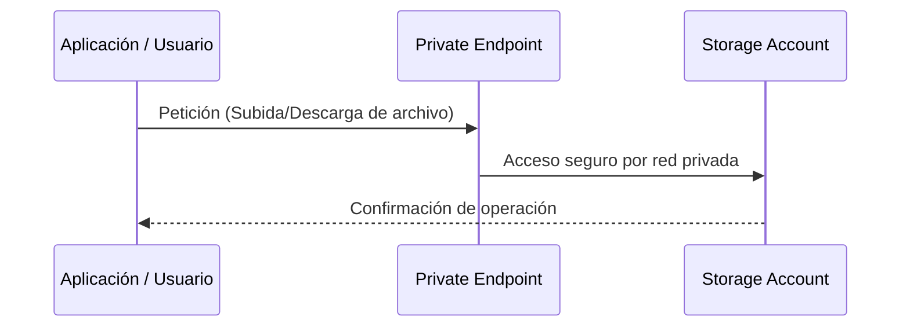

# Terraform Module: Azure Storage Account Infrastructure

Este módulo de Terraform permite configurar un **Azure Storage Account** con soporte para blobs y data lake, asegurando un acceso seguro a través de listas de IP permitidas, integraciones con subnets y compatibilidad con private endpoints.

---

## 🏗 Arquitectura del Módulo



## 🔄 Flujo de Uso



## Requisitos

- **Terraform**: `>= 1.0.0`
- **Provider `azurerm`**: `~> 4.16`

---

## Recursos Proporcionados

1. **Azure Storage Account**:
   - Soporte para LRS, GRS, ZRS, etc.
   - Restricciones de red preconfiguradas.
2. **Blob Containers**:
   - Creación automática de contenedores especificados.

---

## Variables de Entrada

| Variable | Tipo | Descripción | Requerido |
|----------|------|-------------|-----------|
| `resource_group_name` | `string` | Nombre del grupo de recursos. | Sí |
| `identifier` | `string` | Identificador base para el nombre del storage (máx 24 caracteres). | Sí |
| `account_tier` | `string` | Nivel del Storage Account (`Standard` o `Premium`). | No |
| `account_replication_type` | `string` | Tipo de replicación (`LRS`, `GRS`, `ZRS`). | No |
| `enable_public_access` | `bool` | Permitir acceso desde redes públicas (true/false). | No |
| `ip_range_whitelist` | `list(string)` | Lista de rangos de IP (CIDR) permitidos. | No |
| `subnets_id_whitelist` | `list(string)` | Lista de IDs de subnets permitidos. | No |
| `containers` | `list(string)` | Nombres de los contenedores a crear. | No |

---

## Salidas

| Salida | Descripción | Sensible |
|--------|-------------|----------|
| `name` | Nombre del Storage Account creado. | No |
| `primary_access_key` | Clave primaria de acceso. | Sí |
| `primary_connection_string` | Cadena de conexión primaria. | Sí |
| `blob_endpoint` | Endpoint del servicio de Blob. | No |

---

## Uso del Módulo

### Ejemplo Básico

```hcl
module "storage" {
  source = "./module-storage-infrastructure"

  resource_group_name = "mi-grupo-recursos"
  identifier          = "myappstorage"
  
  containers = ["data", "logs", "backups"]
}
```

### Uso Seguro con Private Endpoints y Redes

```hcl
module "storage" {
  source = "./module-storage-infrastructure"

  resource_group_name  = "mi-grupo-recursos"
  identifier           = "myappstorage"
  enable_public_access = false
  
  ip_range_whitelist   = ["190.200.100.0/24"]
  subnets_id_whitelist = ["/subscriptions/.../subnets/mi-subnet"]
  
  containers = ["data"]
}
```
