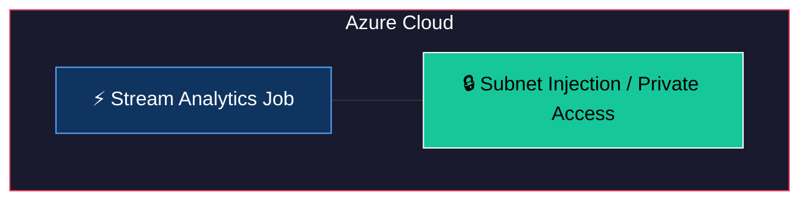
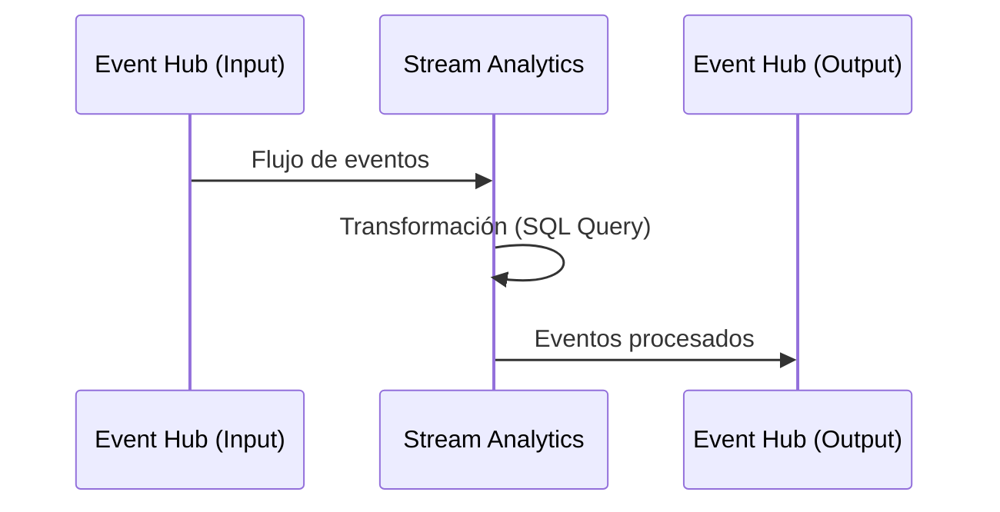

# Terraform Module: Azure Stream Analytics Infrastructure

Este módulo de Terraform permite configurar un **Azure Stream Analytics Job** con soporte para entradas y salidas de Event Hubs, y acceso privado.

---

## 🏗 Arquitectura del Módulo



## 🔄 Flujo de Uso



## Requisitos

- **Terraform**: `>= 1.0.0`
- **Provider `azurerm`**: `~> 4.16`

---

## Recursos Proporcionados

1. **Azure Stream Analytics Job**:
   - Configuración de la tarea de streaming.
   - Definición de compatibilidad y unidades de streaming.
2. **Inputs y Outputs**:
   - Integración nativa con Azure Event Hubs.

---

## Variables de Entrada

| Variable | Tipo | Descripción | Requerido |
|----------|------|-------------|-----------|
| `resource_group_name` | `string` | Nombre del grupo de recursos. | Sí |
| `identifier` | `string` | Identificador único para los recursos. | Sí |
| `transformation_query` | `string` | Query SQL de transformación de datos. | Sí |
| `eventhubs_inputs` | `map(object)` | Configuración de entradas desde Event Hubs. | Sí |
| `eventhubs_outputs` | `map(object)` | Configuración de salidas hacia Event Hubs. | Sí |
| `streaming_units` | `number` | Unidades de streaming para el Job. | No |
| `sku_name` | `string` | Nombre del SKU (`StandardV2`). | No |
| `enable_private_access` | `bool` | Habilitar acceso privado inyectando en Subnet. | No |
| `subnet_id` | `string` | ID de la Subnet para acceso privado. | No |

---

## Salidas

*No se exponen salidas actualmente en este módulo.*

---

## Uso del Módulo

### Ejemplo Básico

```hcl
module "stream_analytics" {
  source = "./module-stream-analytics-infrastructure"

  resource_group_name  = "mi-grupo-recursos"
  identifier           = "mi-stream-analytics"
  transformation_query = "SELECT * INTO output1 FROM input1"

  eventhubs_inputs = {
    "input1" = {
      servicebus_namespace      = "ns-eventhub-dev"
      eventhub_name             = "eh-input"
      shared_access_policy_key  = "..."
    }
  }

  eventhubs_outputs = {
    "output1" = {
      servicebus_namespace      = "ns-eventhub-dev"
      eventhub_name             = "eh-output"
      shared_access_policy_key  = "..."
    }
  }
}
```